# Overview

This component showcases a collection of D3.js powered visualizations such as bullet charts, bar charts, and lollipop charts , designed for simplicity, clarity, and seamless integration. It provides a versatile solution for displaying key metrics and trends within a unified, reusable layout on your Qodly page.

# Bar chart

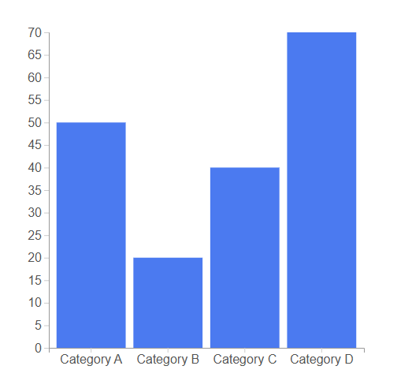

## Qodlysource:

| Name        | Type  | Required | Description                                                         |
| ----------- | ----- | -------- | ------------------------------------------------------------------- |
| Qodlysource | Array | Yes      | Will contain the data collection to be represented by the bar chart |

### Data sample:

```json
[
  { "name": "A", "value": 50 },
  { "name": "B", "value": 20 },
  { "name": "C", "value": 40 },
  { "name": "D", "value": 70 },
  { "name": "E", "value": 100 },
  { "name": "F", "value": "99" }
]
```

## Properties:

| Name           | Type   | Default   | Description                 |
| -------------- | ------ | --------- | --------------------------- |
| Margin Top     | number | 20        | This is the margin top.     |
| Margin Right   | number | 20        | This is the margin right.   |
| Margin Left    | number | 45        | This is the margin left.    |
| Margin Bottom  | number | 30        | This is the margin bottom.  |
| Color          | string | #3b82f6ff | This is the color .         |
| Axis font size | number | 16        | This is the axis font size. |

# Pie chart

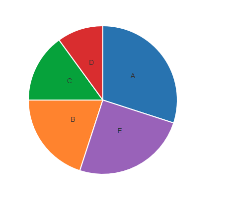

## Qodlysource:

| Name        | Type  | Required | Description                                                         |
| ----------- | ----- | -------- | ------------------------------------------------------------------- |
| Qodlysource | Array | Yes      | Will contain the data collection to be represented by the pie chart |

### Data sample:

```json
[
  { "name": "Apples", "value": 30 },
  { "name": "Oranges", "value": 20 },
  { "name": "Bananas", "value": 15 },
  { "name": "Grapes", "value": 10 },
  { "name": "Berries", "value": 5 },
  { "name": "Lemon", "value": 15 }
]
```

## Properties:

| Name            | Type   | Default   | Description                              |
| --------------- | ------ | --------- | ---------------------------------------- |
| Inner radius    | number | 0         | This is the pie's inner radius.          |
| Outer radius    | number | 150       | This is the pie's outer radius.          |
| Color           | string | #3b82f6ff | This is the color that will be gradiant. |
| Label font size | number | 16        | This is the label's font size.           |

# Line chart

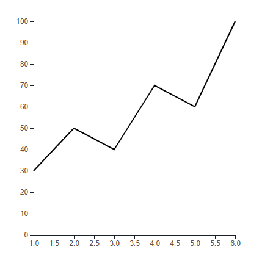

## Qodlysource:

| Name        | Type  | Required | Description                                                          |
| ----------- | ----- | -------- | -------------------------------------------------------------------- |
| Qodlysource | Array | Yes      | Will contain the data collection to be represented by the line chart |

### Data sample:

```json
[
  { "x": 1, "y": 30 },
  { "x": 2, "y": 50 },
  { "x": 3, "y": 40 },
  { "x": 4, "y": 70 },
  { "x": 5, "y": 60 }
]
```

## Properties:

| Name           | Type   | Default   | Description                   |
| -------------- | ------ | --------- | ----------------------------- |
| Color          | string | #000000ff | This is the color.            |
| Axis font size | number | 12        | This is the axis's font size. |
| Margin Top     | number | 20        | This is the margin top.       |
| Margin Right   | number | 20        | This is the margin right.     |
| Margin Left    | number | 45        | This is the margin left.      |
| Margin Bottom  | number | 30        | This is the margin bottom.    |

# Donut chart

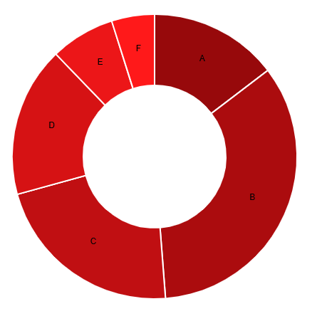

## Qodlysource:

| Name        | Type  | Required | Description                                                           |
| ----------- | ----- | -------- | --------------------------------------------------------------------- |
| Qodlysource | Array | Yes      | Will contain the data collection to be represented by the donut chart |

### Data sample:

```json
[
  { "label": "A", "value": 30 },
  { "label": "B", "value": 70 },
  { "label": "C", "value": 45 },
  { "label": "D", "value": 35 },
  { "label": "E", "value": 25 }
]
```

## Properties:

| Name           | Type   | Default | Description                              |
| -------------- | ------ | ------- | ---------------------------------------- |
| Color          | string |         | This is the color that will be gradient. |
| Text font size | number | 12      | This is the text's font size.            |

# Area chart

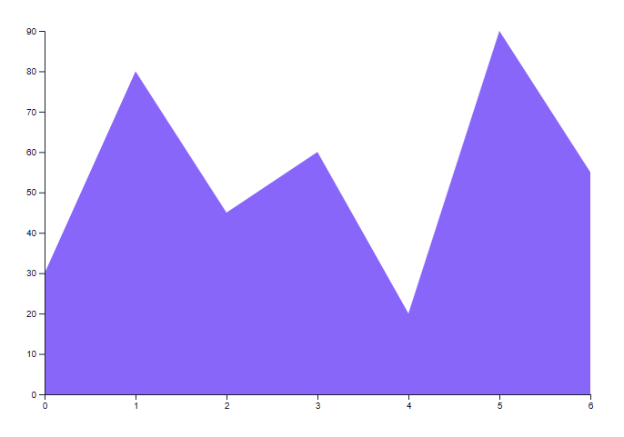

## Qodlysource:

| Name        | Type  | Required | Description                                                          |
| ----------- | ----- | -------- | -------------------------------------------------------------------- |
| Qodlysource | Array | Yes      | Will contain the data collection to be represented by the area chart |

### Data sample:

```json
[
  { "label": "Category A", "value": 30 },
  { "label": "Category B", "value": 80 },
  { "label": "Category C", "value": 60 },
  { "label": "Category D", "value": 60 },
  { "label": "Category E", "value": 60 },
  { "label": "Category F", "value": 45 },
  { "label": "Category G", "value": 100 }
]
```

## Properties:

| Name   | Type   | Default | Description                              |
| ------ | ------ | ------- | ---------------------------------------- |
| Top    | number | 20      | This is the top.                         |
| Right  | number | 30      | This is the right.                       |
| Left   | number | 40      | This is the left.                        |
| Bottom | number | 40      | This is the bottom.                      |
| Color  | string | blue    | This is the color that will be gradient. |

# Bubble chart


## Qodlysource:

| Name        | Type  | Required | Description                                                            |
| ----------- | ----- | -------- | ---------------------------------------------------------------------- |
| Qodlysource | Array | Yes      | Will contain the data collection to be represented by the bubble chart |

### Data sample:

```json
[
  { "name": "A", "value": 40 },
  { "name": "B", "value": 10 },
  { "name": "C", "value": 25 },
  { "name": "D", "value": 15 },
  { "name": "E", "value": 30 }
]
```

## Properties:

| Name           | Type   | Default | Description                              |
| -------------- | ------ | ------- | ---------------------------------------- |
| Circle padding | number | 10      | This is the circle's padding.            |
| font size      | number | 12      | This is the font size.                   |
| Color          | string | blue    | This is the color that will be gradient. |

# Histogram chart

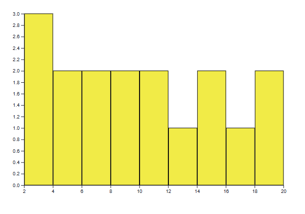

## Qodlysource:

| Name        | Type  | Required | Description                                                               |
| ----------- | ----- | -------- | ------------------------------------------------------------------------- |
| Qodlysource | Array | Yes      | Will contain the data collection to be represented by the histogram chart |

### Data sample:

```json
[12, 19, 3, 5, 2, 3, 9, 8, 11, 6, 4, 10, 14, 18, 7]
```

## Properties:

| Name          | Type   | Default | Description                              |
| ------------- | ------ | ------- | ---------------------------------------- |
| Bins count    | number | 10      | This is the bins' count.                 |
| Color         | string | blue    | This is the color that will be gradient. |
| Bar stroke    | string | black   | This is the bar stroke's color.          |
| Margin Top    | number | 20      | This is the margin top.                  |
| Margin Right  | number | 30      | This is the margin right.                |
| Margin Left   | number | 40      | This is the margin left.                 |
| Margin Bottom | number | 30      | This is the margin bottom.               |

# Scatter chart

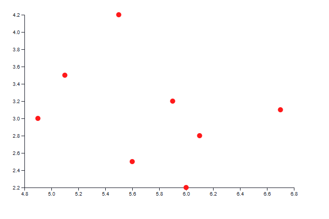

## Qodlysource:

| Name        | Type  | Required | Description                                                             |
| ----------- | ----- | -------- | ----------------------------------------------------------------------- |
| Qodlysource | Array | Yes      | Will contain the data collection to be represented by the scatter chart |

### Data sample:

```json
[
  { "x": 5.1, "y": 3.5 },
  { "x": 4.9, "y": 3 },
  { "x": 6.7, "y": 3.1 },
  { "x": 5.6, "y": 2.5 },
  { "x": 5.9, "y": 3.2 },
  { "x": 6, "y": 2.2 },
  { "x": 6.1, "y": 2.8 },
  { "x": 5.5, "y": 4.2 }
]
```

## Properties:

| Name          | Type   | Default | Description                 |
| ------------- | ------ | ------- | --------------------------- |
| Point color   | string | red     | This is the point's color.  |
| Point radius  | number | 5       | This is the point's radius. |
| Margin Top    | number | 20      | This is the margin top.     |
| Margin Right  | number | 30      | This is the margin right.   |
| Margin Left   | number | 40      | This is the margin left.    |
| Margin Bottom | number | 40      | This is the margin bottom.  |

# Tree chart

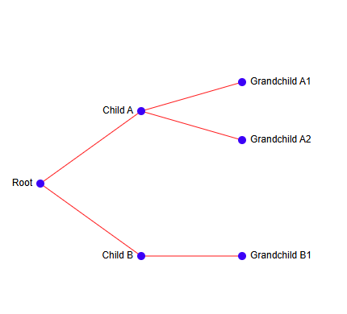

## Qodlysource:

| Name        | Type   | Required | Description                                                      |
| ----------- | ------ | -------- | ---------------------------------------------------------------- |
| Qodlysource | object | Yes      | Will contain the data object to be represented by the tree chart |

### Data sample:

```json
{
  "name": "Company",
  "children": [
    {
      "name": "Engineering",
      "children": [
        { "name": "Frontend Team", "children": [{ "name": "Alice" }, { "name": "Bob" }] },
        { "name": "Backend Team", "children": [{ "name": "Charlie" }, { "name": "David" }] }
      ]
    },
    { "name": "Sales", "children": [{ "name": "Eve" }, { "name": "Frank" }] },
    { "name": "HR", "children": [{ "name": "Grace" }] }
  ]
}
```

## Properties:

| Name          | Type   | Default | Description                 |
| ------------- | ------ | ------- | --------------------------- |
| Node color    | string | blue    | This is the node's color.   |
| Link color    | string | red     | This is the link's color.   |
| Margin Top    | number | 20      | This is the margin top.     |
| Margin Right  | number | 100     | This is the margin right.   |
| Margin Left   | number | 50      | This is the margin left.    |
| Margin Bottom | number | 20      | This is the margin bottom.  |
| Font size     | number | 12      | This is the font size.      |
| Stroke width  | number | 1       | This is the stroke's width. |

# Radar chart

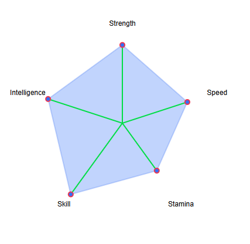

## Qodlysource:

| Name        | Type  | Required | Description                                                           |
| ----------- | ----- | -------- | --------------------------------------------------------------------- |
| Qodlysource | array | Yes      | Will contain the data collection to be represented by the radar chart |

### Data sample:

```json
[
  { "label": "JavaScript", "value": 9 },
  { "label": "TypeScript", "value": 8 },
  { "label": "React", "value": 9 },
  { "label": "Vue", "value": 6 },
  { "label": "Node.js", "value": 8 },
  { "label": "Python", "value": 7 },
  { "label": "SQL", "value": 6 },
  { "label": "DevOps", "value": 5 },
  { "label": "Testing", "value": 7 },
  { "label": "Architecture", "value": 8 },
  { "label": "UI/UX", "value": 7 },
  { "label": "Project Management", "value": 6 }
]
```

## Properties:

| Name               | Type    | Default                 | Description                                      |
| ------------------ | ------- | ----------------------- | ------------------------------------------------ |
| Margin             | number  | 50                      | This is the margin.                              |
| Dot color          | string  | #e73351ff               | This is the dot's color.                         |
| Inner stroke color | string  | #29db25ff               | This is the inner stroke color.                  |
| Outer stroke color | string  | rgba(59, 130, 246, 0.3) | This is the outer stroke color.                  |
| Inner stroke width | number  | 2                       | This is the inner stroke width.                  |
| Outer stroke width | number  | 2                       | This is the outer stroke width.                  |
| Label font size    | number  | 12                      | This is the label font size.                     |
| Label offset       | number  | 20                      | This is the label offset.                        |
| Show Labels        | boolean | true                    | When set the true, the labels will be displayed. |

# Tree map chart

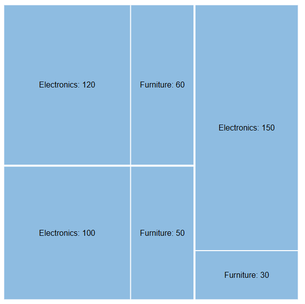

## Qodlysource:

| Name        | Type   | Required | Description                                                         |
| ----------- | ------ | -------- | ------------------------------------------------------------------- |
| Qodlysource | object | Yes      | Will contain the data object to be represented by the treemap chart |

### Data sample:

{"name":"Company Expenses","children":[{"name":"Marketing","children":[{"name":"Advertising","value":500},{"name":"Research","value":300},{"name":"Promotions","value":200}]},{"name":"Operations","children":[{"name":"Labor","value":1200},{"name":"Supplies","value":800},{"name":"Logistics","value":600}]},{"name":"Technology","children":[{"name":"Software","value":700},{"name":"Hardware","value":500},{"name":"Cloud Services","value":300}]},{"name":"Human Resources","children":[{"name":"Salaries","value":1500},{"name":"Training","value":400},{"name":"Benefits","value":300}]}]}

## Properties:

| Name               | Type   | Default   | Description                     |
| ------------------ | ------ | --------- | ------------------------------- |
| Padding            | number | 1         | This is the padding.            |
| Leave color        | string | #8dbee4ff | This is the leave's color.      |
| Inner stroke color | string | #29db25ff | This is the inner stroke color. |
| Stroke color       | string | #fff      | This is the stroke color.       |
| Stroke width       | number | 1         | This is the stroke's width.     |
| Font color         | string | #000      | This is the text font's color.  |

# Radial Bar Chart

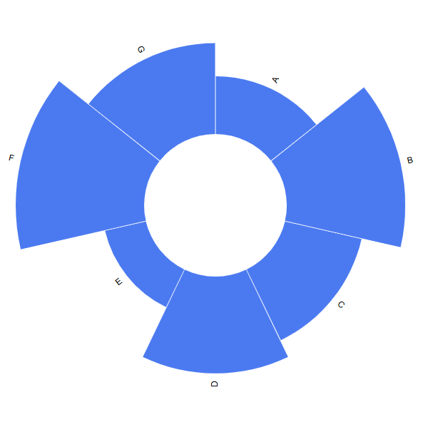

## Qodlysource:

| Name        | Type  | Required | Description                                                                |
| ----------- | ----- | -------- | -------------------------------------------------------------------------- |
| Qodlysource | array | Yes      | Will contain the data collection to be represented by the radial bar chart |

### Data sample:

[{"name":"Engineering","value":88},{"name":"Design","value":70},{"name":"Marketing","value":65},{"name":"Sales","value":80},{"name":"HR","value":50},{"name":"Customer Success","value":77},{"name":"IT","value":60}]

## Properties:

| Name         | Type    | Default | Description                               |
| ------------ | ------- | ------- | ----------------------------------------- |
| Inner radius | number  | 100     | This is the inner radius.                 |
| Color        | string  | #3b82f6 | This is the color.                        |
| Show labels  | boolran | true    | When set to true, labels will be visible. |
| Font size    | number  | 12      | This is the font's size.                  |

# Bullet chart

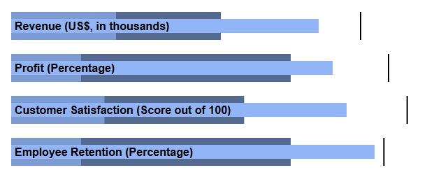

## Qodlysource:

| Name        | Type  | Required | Description                                                            |
| ----------- | ----- | -------- | ---------------------------------------------------------------------- |
| Qodlysource | array | Yes      | Will contain the data collection to be represented by the bullet chart |

### Data sample:

```json
[
  {
    "label": "Website Traffic",
    "unit": "Visits (in thousands)",
    "thresholds": [50, 100, 150],
    "value": 120,
    "target": 140
  },
  {
    "label": "Lead Conversion Rate",
    "unit": "Percentage",
    "thresholds": [1, 3, 5],
    "value": 2.7,
    "target": 4
  },
  {
    "label": "Email Open Rate",
    "unit": "Percentage",
    "thresholds": [10, 20, 30],
    "value": 22,
    "target": 28
  },
  {
    "label": "Social Media Engagement",
    "unit": "Score (out of 100)",
    "thresholds": [40, 60, 80],
    "value": 65,
    "target": 75
  },
  {
    "label": "Customer Satisfaction",
    "unit": "Score (out of 10)",
    "thresholds": [4, 7, 9],
    "value": 8,
    "target": 9
  },
  {
    "label": "Support Ticket Resolution Time",
    "unit": "Hours",
    "thresholds": [24, 48, 72],
    "value": 36,
    "target": 30
  }
]
```

## Properties:

| Name             | Type    | Default | Description                                                   |
| ---------------- | ------- | ------- | ------------------------------------------------------------- |
| Margin Top       | number  | 20      | This is the margin top.                                       |
| Margin Right     | number  | 20      | This is the margin right.                                     |
| Margin Left      | number  | 20      | This is the margin left.                                      |
| Margin Bottom    | number  | 20      | This is the margin bottom.                                    |
| Color            | string  | blue    | This is the color.                                            |
| Show target line | boolean | true    | When set to true, the target lines at the end will be visible |

# Lollipop chart

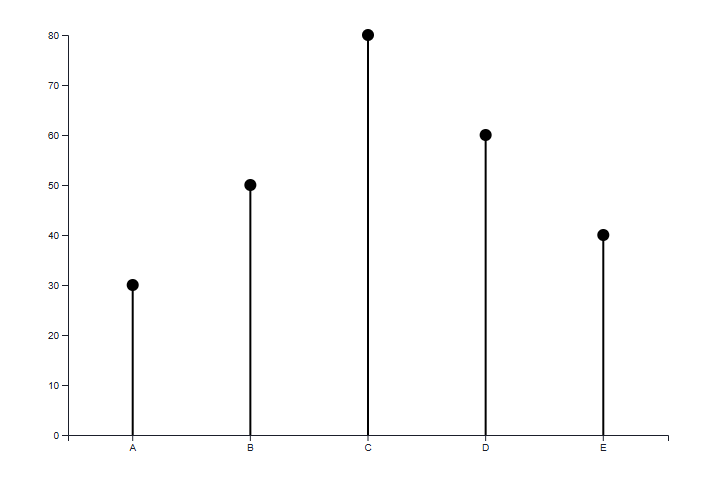

## Qodlysource:

| Name        | Type  | Required | Description                                                              |
| ----------- | ----- | -------- | ------------------------------------------------------------------------ |
| Qodlysource | array | Yes      | Will contain the data collection to be represented by the lollipop chart |

### Data sample:

```json
[
  { "label": "Sales Q1", "value": 120 },
  { "label": "Sales Q2", "value": 200 },
  { "label": "Sales Q3", "value": 150 },
  { "label": "Sales Q4", "value": 180 }
]
```

## Properties:

| Name          | Type   | Default | Description                |
| ------------- | ------ | ------- | -------------------------- |
| Margin Top    | number | 20      | This is the margin top.    |
| Margin Right  | number | 20      | This is the margin right.  |
| Margin Left   | number | 60      | This is the margin left.   |
| Margin Bottom | number | 40      | This is the margin bottom. |
| Color         | string | #000000 | This is the color.         |
| Dot size      | number | 6       | This is the dot' size      |
| Stroke width  | number | 2       | This is the stroke's width |
